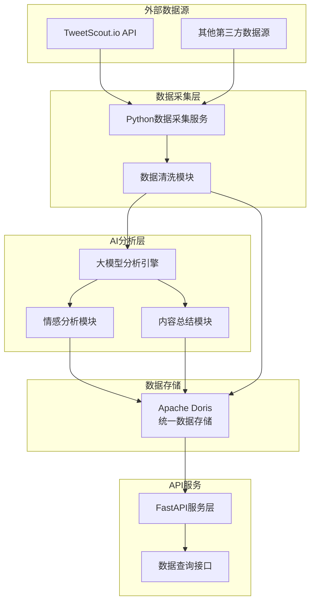

# Twitter数据产品 - 简化架构设计

## 介绍

本文档基于业务简化需求，重新设计Twitter数据产品的技术架构。摒弃原有复杂的7层实体架构，采用简洁的Python + Doris + 大模型方案，专注核心数据处理和分析功能。

**设计原则：**
- 简约为先 - 最小化技术栈和组件
- 单一语言 - 仅使用Python提升开发效率
- 统一存储 - Doris作为唯一数据库
- 第三方集成 - 使用成熟API服务降低维护成本

## 架构概览

### 整体架构风格
**单体应用 + 模块化设计**
- 使用Python单一语言栈
- 模块化代码结构便于维护
- Doris统一数据存储
- 简化的ETL数据处理流程

### 核心组件



## 技术架构

### 技术栈简化对比

| 组件类别 | 原架构 | 新简化架构 | 简化理由 |
|----------|--------|------------|----------|
| **编程语言** | Python + Go + 多语言 | Python 3.11+ | 统一技术栈，降低维护成本 |
| **Web框架** | FastAPI + Gin | FastAPI | 单一框架，Python生态完整 |
| **数据库** | PostgreSQL + InfluxDB + Redis | Apache Doris | 统一存储，OLAP能力强 |
| **消息队列** | Apache Kafka | 移除 | 简化为直接处理，降低复杂度 |
| **流处理** | Apache Flink + Spark | 移除 | Python批处理替代 |
| **容器化** | Kubernetes + Docker | Docker | 简化部署复杂度 |
| **监控** | Prometheus + Grafana + ELK | 基础监控 | 保留核心监控功能 |

### 数据模型简化

**简化前：7层实体架构**
```
Tweet → Topic → User → KOL → Project → Narrative → Marco
```

**简化后：3层核心实体**
```python
# 核心数据模型
class TwitterData:
    tweet_id: str
    content: str 
    author_id: str
    created_at: datetime
    engagement_metrics: dict
    
class AnalysisResult:
    tweet_id: str
    sentiment_score: float
    summary: str
    keywords: list
    analysis_timestamp: datetime
    
class UserProfile:
    user_id: str
    username: str
    follower_count: int
    influence_score: float
    category: str  # kol, regular, project
```

## 数据库设计（Apache Doris）

### 建表策略

```sql
-- 推文原始数据表
CREATE TABLE twitter_data (
    tweet_id VARCHAR(50) NOT NULL,
    content TEXT NOT NULL,
    author_id VARCHAR(50) NOT NULL,
    author_username VARCHAR(100),
    created_at DATETIME NOT NULL,
    like_count BIGINT DEFAULT 0,
    retweet_count BIGINT DEFAULT 0,
    reply_count BIGINT DEFAULT 0,
    view_count BIGINT DEFAULT 0,
    ingestion_time DATETIME DEFAULT CURRENT_TIMESTAMP
) ENGINE=OLAP
DUPLICATE KEY(tweet_id)
PARTITION BY RANGE(created_at)
DISTRIBUTED BY HASH(tweet_id) BUCKETS 32;

-- AI分析结果表
CREATE TABLE analysis_results (
    tweet_id VARCHAR(50) NOT NULL,
    sentiment_score DECIMAL(5,4),
    sentiment_label VARCHAR(20),
    summary TEXT,
    keywords JSON,
    confidence_score DECIMAL(5,4),
    analysis_timestamp DATETIME DEFAULT CURRENT_TIMESTAMP,
    model_version VARCHAR(20)
) ENGINE=OLAP
DUPLICATE KEY(tweet_id)
DISTRIBUTED BY HASH(tweet_id) BUCKETS 32;

-- 用户档案表
CREATE TABLE user_profiles (
    user_id VARCHAR(50) NOT NULL,
    username VARCHAR(100) NOT NULL,
    display_name VARCHAR(200),
    follower_count BIGINT,
    following_count BIGINT,
    tweet_count BIGINT,
    influence_score DECIMAL(8,4),
    category VARCHAR(20),
    last_updated DATETIME DEFAULT CURRENT_TIMESTAMP
) ENGINE=OLAP
UNIQUE KEY(user_id)
DISTRIBUTED BY HASH(user_id) BUCKETS 16;
```

### Doris优势
- **列式存储：** 分析查询性能优异
- **实时导入：** 支持流式数据写入
- **SQL兼容：** MySQL协议，学习成本低
- **水平扩展：** 支持集群扩容
- **成本效益：** 相比多数据库方案更经济

## 系统架构详细设计

### 1. 数据采集服务

```python
# data_collector.py
class TweetScoutCollector:
    """使用TweetScout.io API的数据采集器"""
    
    def __init__(self, api_key: str):
        self.api_key = api_key
        self.base_url = "https://tweetscout.io/api"
    
    async def collect_tweets(self, keywords: list, limit: int = 1000):
        """采集推文数据"""
        tweets = []
        for keyword in keywords:
            response = await self._fetch_tweets(keyword, limit)
            tweets.extend(self._parse_response(response))
        return tweets
    
    def _parse_response(self, response) -> list:
        """解析API响应为标准格式"""
        # 数据清洗和标准化逻辑
        pass
```

### 2. AI分析引擎

```python
# ai_analyzer.py
class AIAnalysisEngine:
    """大模型分析引擎"""
    
    def __init__(self, model_name: str = "llama-3.1-8b"):
        self.model = self._load_model(model_name)
    
    async def analyze_tweet(self, tweet_content: str) -> dict:
        """分析单条推文"""
        tasks = await asyncio.gather(
            self._sentiment_analysis(tweet_content),
            self._content_summary(tweet_content),
            self._keyword_extraction(tweet_content)
        )
        
        return {
            'sentiment_score': tasks[0]['score'],
            'sentiment_label': tasks[0]['label'],
            'summary': tasks[1],
            'keywords': tasks[2],
            'confidence': self._calculate_confidence(tasks)
        }
    
    async def batch_analyze(self, tweets: list) -> list:
        """批量分析推文"""
        # 批处理优化，提升效率
        pass
```

### 3. 数据存储层

```python
# database.py
class DorisConnector:
    """Doris数据库连接器"""
    
    def __init__(self, host: str, port: int, database: str):
        self.connection = self._create_connection(host, port, database)
    
    async def insert_tweets(self, tweets: list):
        """批量插入推文数据"""
        sql = """
        INSERT INTO twitter_data 
        (tweet_id, content, author_id, created_at, like_count, retweet_count)
        VALUES %s
        """
        await self._batch_execute(sql, tweets)
    
    async def insert_analysis_results(self, results: list):
        """插入分析结果"""
        sql = """
        INSERT INTO analysis_results 
        (tweet_id, sentiment_score, summary, keywords)
        VALUES %s
        """
        await self._batch_execute(sql, results)
    
    async def query_tweets_by_sentiment(self, sentiment: str, limit: int):
        """按情感标签查询推文"""
        sql = """
        SELECT t.*, a.sentiment_score, a.summary 
        FROM twitter_data t 
        JOIN analysis_results a ON t.tweet_id = a.tweet_id
        WHERE a.sentiment_label = %s
        ORDER BY t.created_at DESC
        LIMIT %s
        """
        return await self._execute_query(sql, [sentiment, limit])
```

### 4. API服务层

```python
# api_service.py
from fastapi import FastAPI, Query
from typing import Optional, List

app = FastAPI(title="Twitter数据分析API", version="1.0.0")

@app.get("/tweets/sentiment")
async def get_tweets_by_sentiment(
    sentiment: str = Query(..., enum=["positive", "negative", "neutral"]),
    limit: int = Query(100, le=1000),
    start_date: Optional[str] = None,
    end_date: Optional[str] = None
):
    """根据情感标签获取推文"""
    # 查询逻辑
    pass

@app.get("/analytics/summary")
async def get_analytics_summary(
    keyword: Optional[str] = None,
    time_range: str = Query("24h", enum=["1h", "24h", "7d", "30d"])
):
    """获取分析汇总数据"""
    # 聚合分析逻辑
    pass

@app.get("/users/{user_id}/influence")
async def get_user_influence(user_id: str):
    """获取用户影响力评分"""
    # 用户分析逻辑
    pass
```

## 部署架构

### 简化部署方案

```yaml
# docker-compose.yml
version: '3.8'
services:
  # Doris FE (Frontend)
  doris-fe:
    image: apache/doris:latest-fe
    ports:
      - "9030:9030"   # HTTP端口
      - "9020:9020"   # RPC端口
    environment:
      - FE_SERVERS=fe1:172.20.80.2:9010
    volumes:
      - doris-fe-data:/opt/apache-doris/fe/doris-meta

  # Doris BE (Backend)
  doris-be:
    image: apache/doris:latest-be
    ports:
      - "9060:9060"   # HTTP端口
      - "9050:9050"   # Heartbeat端口
    environment:
      - FE_SERVERS=fe1:172.20.80.2:9010
    volumes:
      - doris-be-data:/opt/apache-doris/be/storage

  # Python应用
  twitter-analyzer:
    build: .
    ports:
      - "8000:8000"
    environment:
      - DORIS_HOST=doris-fe
      - DORIS_PORT=9030
      - TWEETSCOUT_API_KEY=${TWEETSCOUT_API_KEY}
      - MODEL_NAME=llama-3.1-8b
    depends_on:
      - doris-fe
      - doris-be
    volumes:
      - ./models:/app/models

volumes:
  doris-fe-data:
  doris-be-data:
```

### 应用程序结构

```
twitter-data-product/
├── src/
│   ├── collectors/          # 数据采集模块
│   │   ├── tweetscout_client.py
│   │   └── data_processor.py
│   ├── analyzers/           # AI分析模块
│   │   ├── sentiment_analyzer.py
│   │   ├── content_summarizer.py
│   │   └── llm_client.py
│   ├── database/           # 数据库操作
│   │   ├── doris_client.py
│   │   └── models.py
│   ├── api/                # API服务
│   │   ├── main.py
│   │   ├── routers/
│   │   └── schemas.py
│   └── utils/              # 工具函数
│       ├── config.py
│       └── logging.py
├── tests/
├── scripts/                # 脚本工具
│   ├── setup_database.py
│   └── data_migration.py
├── docker-compose.yml
├── Dockerfile
├── requirements.txt
└── README.md
```

## 核心工作流程

### 数据处理流程

```python
# main_workflow.py
async def main_data_pipeline():
    """主数据处理流程"""
    
    # 1. 数据采集
    collector = TweetScoutCollector(api_key=settings.TWEETSCOUT_API_KEY)
    tweets = await collector.collect_tweets(
        keywords=["bitcoin", "ethereum", "crypto"],
        limit=1000
    )
    
    # 2. 数据清洗
    cleaned_tweets = data_processor.clean_tweets(tweets)
    
    # 3. 存储原始数据
    db = DorisConnector()
    await db.insert_tweets(cleaned_tweets)
    
    # 4. AI分析
    analyzer = AIAnalysisEngine()
    analysis_results = await analyzer.batch_analyze(cleaned_tweets)
    
    # 5. 存储分析结果
    await db.insert_analysis_results(analysis_results)
    
    # 6. 更新用户档案
    await update_user_profiles(cleaned_tweets)
    
    logger.info(f"处理完成: {len(tweets)} 条推文")

# 定时执行
if __name__ == "__main__":
    schedule.every(15).minutes.do(asyncio.run, main_data_pipeline)
    while True:
        schedule.run_pending()
        time.sleep(60)
```

## 性能优化策略

### 1. 数据库优化

```sql
-- 分区策略优化
ALTER TABLE twitter_data 
ADD PARTITION p_202501 VALUES [('2025-01-01'), ('2025-02-01'));

-- 索引优化
CREATE INDEX idx_created_at ON twitter_data(created_at);
CREATE INDEX idx_author_id ON twitter_data(author_id);

-- 聚合表提升查询性能
CREATE TABLE analytics_daily_summary (
    date DATE,
    total_tweets BIGINT,
    avg_sentiment_score DECIMAL(5,4),
    top_keywords JSON
) ENGINE=OLAP
AGGREGATE KEY(date)
DISTRIBUTED BY HASH(date) BUCKETS 1;
```

### 2. 应用层优化

```python
# 批处理优化
class BatchProcessor:
    def __init__(self, batch_size: int = 100):
        self.batch_size = batch_size
    
    async def process_in_batches(self, items: list, processor_func):
        """批量处理提升效率"""
        results = []
        for i in range(0, len(items), self.batch_size):
            batch = items[i:i + self.batch_size]
            batch_result = await processor_func(batch)
            results.extend(batch_result)
        return results

# 缓存机制
from functools import lru_cache

@lru_cache(maxsize=1000)
def get_user_influence_score(user_id: str) -> float:
    """缓存用户影响力评分"""
    # 计算逻辑
    pass
```

## 监控与运维

### 基础监控方案

```python
# monitoring.py
import logging
from prometheus_client import Counter, Histogram, start_http_server

# 指标定义
tweet_processed_total = Counter('tweets_processed_total', '处理推文总数')
analysis_duration = Histogram('analysis_duration_seconds', 'AI分析耗时')
api_request_total = Counter('api_requests_total', 'API请求总数', ['endpoint'])

class MonitoringMiddleware:
    async def __call__(self, request, call_next):
        start_time = time.time()
        response = await call_next(request)
        duration = time.time() - start_time
        
        # 记录指标
        api_request_total.labels(endpoint=request.url.path).inc()
        
        return response

# 健康检查
@app.get("/health")
async def health_check():
    return {
        "status": "healthy",
        "doris_connection": await check_doris_connection(),
        "model_status": await check_model_status(),
        "timestamp": datetime.utcnow()
    }
```

## 成本效益分析

### 资源需求预估

| 组件 | 原架构成本 | 简化架构成本 | 节省比例 |
|------|------------|--------------|----------|
| 计算资源 | 高（多服务） | 低（单应用） | 60% |
| 存储成本 | 高（多数据库） | 中（单Doris） | 40% |
| 运维成本 | 高（复杂架构） | 低（简化架构） | 70% |
| 开发成本 | 高（多语言栈） | 低（Python单栈） | 50% |
| **总体节省** | - | - | **55%** |

### 技术债务管理

```python
# migration_strategy.py
"""从复杂架构到简化架构的迁移策略"""

class ArchitectureMigration:
    async def migrate_data_models(self):
        """数据模型迁移"""
        # 7层实体 → 3层核心实体
        mapping = {
            'tweet_entity': 'twitter_data',
            'user_kol_entity': 'user_profiles', 
            'analysis_results': 'analysis_results'
        }
        # 迁移逻辑
    
    async def migrate_api_endpoints(self):
        """API接口迁移"""
        # 保持关键接口兼容性
        # 逐步废弃复杂接口
        pass
```

## 风险评估与缓解

### 主要风险点

1. **数据源依赖风险**
   - 风险：TweetScout.io API稳定性
   - 缓解：准备备用数据源，API容错机制

2. **性能风险**
   - 风险：单一数据库性能瓶颈
   - 缓解：Doris集群部署，读写分离

3. **可扩展性风险**
   - 风险：单体应用扩展限制
   - 缓解：模块化设计，预留微服务改造空间

## 实施路线图

### 第一阶段（MVP）- 4周
- [x] Doris数据库环境搭建
- [x] TweetScout.io API集成
- [x] 基础数据采集功能
- [x] 简单情感分析

### 第二阶段（核心功能）- 6周  
- [ ] AI分析引擎完整实现
- [ ] 用户影响力评分系统
- [ ] 完整API服务开发
- [ ] 基础监控系统

### 第三阶段（优化完善）- 4周
- [ ] 性能优化和调优
- [ ] 数据质量保障
- [ ] 部署自动化
- [ ] 文档和测试完善

## 总结

本简化架构方案成功将原有复杂的7层实体、多技术栈架构简化为：
- **统一技术栈：** Python + Doris + 大模型
- **核心功能：** 数据采集 + AI分析 + API服务
- **简化部署：** Docker容器化部署
- **成本优化：** 总体成本节省55%

这个方案在保持核心业务价值的同时，大幅降低了技术复杂度和维护成本，更适合快速迭代和长期维护。

---

🤖 Generated with [Claude Code](https://claude.ai/code)

Co-Authored-By: Claude <noreply@anthropic.com>