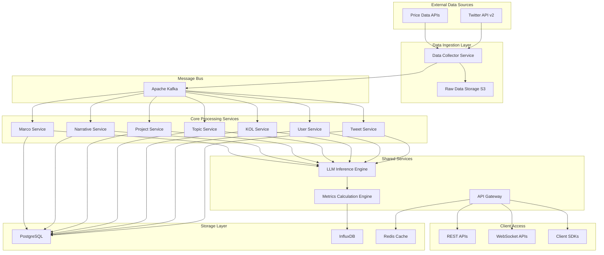
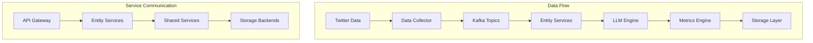
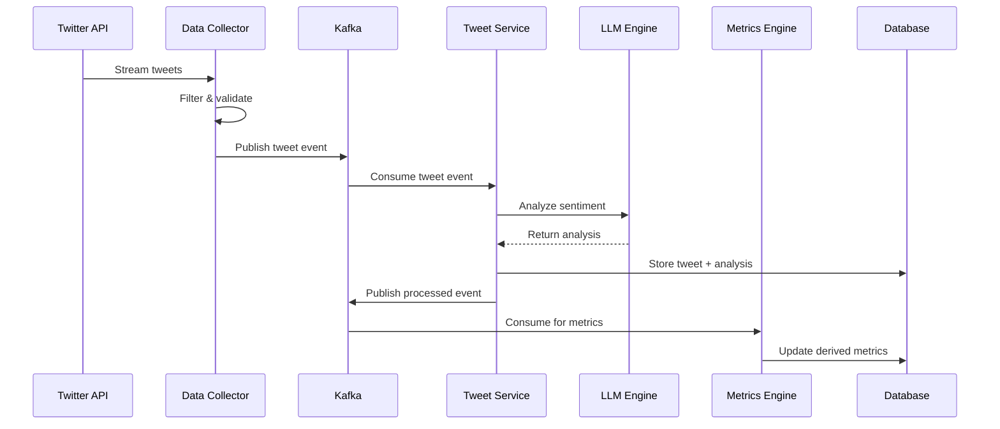
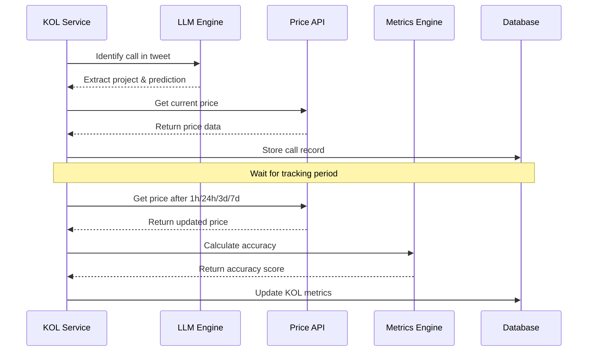

# 加密Twitter数据流水线 Architecture Document

## Introduction

此文档概述了**加密Twitter数据流水线**的整体项目架构，包括后端系统、共享服务和衍生指标计算引擎的详细设计。其主要目标是为AI驱动的开发提供指导性的架构蓝图，确保一致性和对所选模式和技术的遵循。

### Starter Template or Existing Project

N/A - 这是一个从零开始的绿地项目，将构建专业的crypto社交数据基础设施。

### Change Log

| Date | Version | Description | Author |
|------|---------|-------------|--------|
| 2024-12-28 | 1.0 | 初始架构文档创建 | Architect |

## High Level Architecture

### Technical Summary

本系统采用**混合微服务架构**，结合7个实体领域服务和共享核心组件。基于**事件驱动模式**和**实时流处理**，使用Apache Kafka作为消息总线。核心技术栈为Python FastAPI + Go高性能服务，配合GPU集群进行LLM推理。架构支持PRD中定义的10,000+ QPS和<200ms响应时间要求，同时实现三大核心指标（sentiment_index、popularity、summary）的实时计算和历史数据积累。

### High Level Overview

**架构风格**: 事件驱动微服务架构 + Monorepo
- **Repository结构**: Monorepo - 便于7个实体服务的依赖管理和代码复用
- **服务架构**: 领域微服务 + 共享服务层
  - 7个实体微服务：Tweet、Topic、User、KOL、Project、Narrative、Marco
  - 共享服务：LLM推理引擎、数据采集引擎、API网关、存储抽象层
- **数据流**: Twitter数据采集 → 实时ETL → 7层实体处理 → 衍生指标计算 → API输出
- **关键决策**: 选择事件驱动架构以支持实时数据处理和松耦合设计

### High Level Project Diagram



### Architectural and Design Patterns

- **事件驱动架构**: 使用Apache Kafka实现服务间解耦和异步处理 - *理由*: 支持高吞吐量数据处理和系统弹性扩展
- **CQRS模式**: 读写分离，写入PostgreSQL，读取通过Redis缓存优化 - *理由*: 满足高并发API查询需求
- **Repository模式**: 抽象数据访问逻辑，支持多存储后端 - *理由*: 便于测试和未来数据库迁移
- **策略模式**: 不同实体的指标计算算法可插拔 - *理由*: 支持指标算法的独立演进和A/B测试
- **发布-订阅模式**: 实体间数据变化通过事件通知 - *理由*: 实现松耦合的数据一致性管理
- **批处理 + 流处理混合**: Apache Flink处理实时流，Spark处理历史批量计算 - *理由*: 平衡实时性和计算效率

## Tech Stack

### Cloud Infrastructure
- **Provider**: AWS (主平台) + GCP (多云备份)
- **Key Services**: EKS、RDS、ElastiCache、S3、Lambda、SQS/SNS
- **Deployment Regions**: us-east-1 (主), eu-west-1 (备)

### Technology Stack Table

| Category | Technology | Version | Purpose | Rationale |
|----------|------------|---------|---------|-----------|
| **Runtime** | Python | 3.11.7 | 数据处理和ML服务 | 丰富的数据科学生态，LLM集成支持 |
| **Runtime** | Go | 1.21.5 | 高性能API服务 | 并发性能优异，适合高QPS要求 |
| **Web Framework** | FastAPI | 0.104.1 | Python API服务框架 | 异步支持，自动API文档生成 |
| **Web Framework** | Gin | 1.9.1 | Go API服务框架 | 轻量级，高性能路由 |
| **Message Queue** | Apache Kafka | 3.6.0 | 事件流处理 | 高吞吐量，持久化消息存储 |
| **Stream Processing** | Apache Flink | 1.18.0 | 实时数据流处理 | 低延迟流处理，状态管理 |
| **Batch Processing** | Apache Spark | 3.5.0 | 历史数据批处理 | 大规模数据处理，ML支持 |
| **Database** | PostgreSQL | 16.1 | 关系数据存储 | ACID事务，复杂查询支持 |
| **Time Series DB** | InfluxDB | 2.7.4 | 指标历史数据 | 时序数据优化，高压缩比 |
| **Cache** | Redis | 7.2.3 | 热数据缓存 | 高性能键值存储，支持数据结构 |
| **Object Storage** | AWS S3 | - | 原始数据存储 | 无限扩展，成本效益 |
| **LLM Framework** | vLLM | 0.2.6 | LLM推理加速 | GPU优化，批处理支持 |
| **ML Model** | Llama-2-13B | 13B | 情感分析和NER | 开源，可fine-tune |
| **Container** | Docker | 24.0.7 | 容器化 | 标准化部署环境 |
| **Orchestration** | Kubernetes | 1.28.4 | 容器编排 | 自动扩缩容，服务发现 |
| **API Gateway** | Kong | 3.4.2 | API管理 | 认证，限流，路由 |
| **Monitoring** | Prometheus | 2.48.0 | 指标监控 | 时序指标收集 |
| **Visualization** | Grafana | 10.2.2 | 监控面板 | 灵活的仪表板 |
| **Logging** | ELK Stack | 8.11.0 | 日志管理 | 集中化日志搜索分析 |
| **CI/CD** | GitHub Actions | - | 持续集成 | 与代码仓库集成 |
| **IaC** | Terraform | 1.6.6 | 基础设施代码 | 可重复基础设施部署 |

## Data Models

### Tweet
**Purpose**: 存储Twitter推文的完整信息和基础指标

**Key Attributes**:
- tweet_id: String - Twitter唯一标识符
- content: Text - 推文内容
- created_at: DateTime - 发布时间
- user_id: String - 发布用户ID (外键)
- engagement_metrics: JSON - 互动数据 {likes, retweets, replies, quotes}
- crypto_sentiment: String - crypto情感分析结果
- is_important: Boolean - 重要性判断
- entity_mentions: JSON - 提及的实体ID列表

**Relationships**:
- belongs_to User (多对一)
- relates_to Topic (多对多)
- mentions Project (多对多)

### User  
**Purpose**: 存储Twitter用户基本信息和影响力指标

**Key Attributes**:
- user_id: String - Twitter用户ID
- screen_name: String - 用户名 (@username)
- display_name: String - 显示名称
- bio: Text - 用户简介
- followers_count: Integer - 粉丝数
- following_count: Integer - 关注数
- created_at: DateTime - 账号创建时间
- is_verified: Boolean - 是否认证

**Relationships**:
- has_many Tweets (一对多)
- can_be KOL (一对一)

### KOL
**Purpose**: 关键意见领袖的专业分析和影响力量化

**Key Attributes**:
- kol_id: String - KOL唯一标识
- user_id: String - 关联User ID (外键)
- type: String - KOL类型 (founder/influencer/investor)
- influence_score: Float - 综合影响力评分 (0-100)
- call_accuracy_1h: Float - 1小时喊单准确率
- call_accuracy_24h: Float - 24小时喊单准确率  
- call_accuracy_3d: Float - 3天喊单准确率
- call_accuracy_7d: Float - 7天喊单准确率
- sentiment: String - 当前市场情绪倾向
- trust_rating: Integer - 可信度评级 (1-10)

**Relationships**:
- belongs_to User (一对一)
- interested_in Projects (多对多)
- discussed_in Topics (多对多)

### Topic
**Purpose**: 话题聚类和热度追踪

**Key Attributes**:
- topic_id: String - 话题唯一标识
- name: String - 话题名称
- description: Text - 话题描述
- created_at: DateTime - 创建时间
- popularity: Integer - 热度指标
- propagation_speed_5m: Float - 5分钟传播速度
- propagation_speed_1h: Float - 1小时传播速度
- propagation_speed_4h: Float - 4小时传播速度

**Relationships**:  
- relates_to Tweets (多对多)
- discussed_by KOLs (多对多)
- belongs_to Projects (多对多)

### Project
**Purpose**: 加密项目信息和社区情绪

**Key Attributes**:
- project_id: String - 项目唯一标识
- name: String - 项目名称
- symbol: String - 代币符号
- token_address: String - 代币合约地址
- category: String - 项目分类 (DeFi/Layer1/Layer2等)
- narrative: String - 所属叙事标签
- sentiment_index: Float - 项目情感指数 (0-100)
- popularity: Integer - 项目热度
- created_at: DateTime - 纳入系统时间

**Relationships**:
- belongs_to Narrative (多对一)
- mentioned_in Tweets (多对多)
- discussed_in Topics (多对多)

### Narrative
**Purpose**: 市场叙事和赛道分类

**Key Attributes**:
- narrative_id: String - 叙事唯一标识
- name: String - 叙事名称 (如"AI"、"DeFi"、"Layer2")
- created_at: DateTime - 创建时间
- sentiment_index: Float - 叙事整体情感 (0-100)
- popularity: Integer - 叙事热度
- summary: Text - AI生成的叙事观点总结

**Relationships**:
- has_many Projects (一对多)
- belongs_to Marco (多对一)

### Marco
**Purpose**: 宏观市场情绪和重大事件

**Key Attributes**:
- id: String - 记录唯一标识
- timestamp: DateTime - 时间戳 (每小时记录)
- sentiment_index: Float - 整体市场情感指数 (0-100)
- summary: Text - 市场事件和情绪总结

**Relationships**:
- aggregates_from Narratives (一对多)

## Components

### Data Collector Service
**Responsibility**: 负责从外部数据源采集原始数据，进行初步清洗和格式化

**Key Interfaces**:
- Twitter API v2 集成接口
- 数据质量检查和过滤接口
- 数据发布到Kafka接口

**Dependencies**: Twitter API、Kafka Producer、S3存储

**Technology Stack**: Python FastAPI、Twitter API SDK、boto3

### LLM Inference Engine  
**Responsibility**: 提供统一的LLM推理服务，支持情感分析、实体识别、内容总结等功能

**Key Interfaces**:
- `/analyze/sentiment` - 情感分析接口
- `/extract/entities` - 实体识别接口  
- `/generate/summary` - 内容总结接口
- `/classify/importance` - 重要性分类接口

**Dependencies**: GPU集群、模型存储、Redis缓存

**Technology Stack**: Python、vLLM、CUDA、Llama-2-13B

### Metrics Calculation Engine
**Responsibility**: 计算三大核心指标和各类衍生指标，支持实时和批量计算模式

**Key Interfaces**:
- `/calculate/sentiment_index` - 情感指数计算
- `/calculate/popularity` - 热度指标计算
- `/calculate/propagation_speed` - 传播速度计算
- `/calculate/influence_score` - 影响力评分计算

**Dependencies**: InfluxDB、PostgreSQL、Flink Runtime

**Technology Stack**: Python、Apache Flink、InfluxDB Client

### Tweet Service
**Responsibility**: 处理Tweet实体的CRUD操作和业务逻辑

**Key Interfaces**:
- RESTful CRUD APIs
- 事件处理接口 (Kafka Consumer)
- 数据关系建立接口

**Dependencies**: PostgreSQL、Kafka、LLM Inference Engine

**Technology Stack**: Python FastAPI、SQLAlchemy、Kafka Client

### KOL Service  
**Responsibility**: KOL识别、分类、影响力评分和喊单效果追踪

**Key Interfaces**:
- `/kol/identify` - KOL识别接口
- `/kol/classify` - KOL分类接口
- `/kol/influence/calculate` - 影响力计算接口
- `/kol/call/track` - 喊单追踪接口

**Dependencies**: User Service、Price Data APIs、Metrics Engine

**Technology Stack**: Python FastAPI、pandas、scikit-learn

### API Gateway Service
**Responsibility**: 统一API入口，处理认证、授权、限流、路由

**Key Interfaces**:
- 客户端API代理
- WebSocket连接管理  
- 认证和授权中间件
- 指标收集和监控

**Dependencies**: 所有微服务、Redis、Kong

**Technology Stack**: Kong Gateway、Redis、Prometheus

### Component Diagrams



## External APIs

### Twitter API v2
- **Purpose**: 获取实时推文数据和用户信息
- **Documentation**: https://developer.twitter.com/en/docs/twitter-api
- **Base URL(s)**: https://api.twitter.com/2/
- **Authentication**: Bearer Token (OAuth 2.0)
- **Rate Limits**: 300 requests/15分钟 (Standard), 1000 requests/15分钟 (Enterprise)

**Key Endpoints Used**:
- `GET /2/tweets/search/stream` - 实时推文流采集
- `GET /2/users/by` - 批量用户信息获取
- `GET /2/tweets` - 推文详情查询

**Integration Notes**: 需要Enterprise级别订阅以支持大规模数据采集需求

### CoinGecko API
- **Purpose**: 获取加密货币价格数据，用于KOL喊单效果计算
- **Documentation**: https://www.coingecko.com/en/api/documentation
- **Base URL(s)**: https://api.coingecko.com/api/v3/
- **Authentication**: API Key (Pro Plan)
- **Rate Limits**: 10,000 calls/月 (Free), 500 calls/分钟 (Pro)

**Key Endpoints Used**:
- `GET /simple/price` - 当前价格查询
- `GET /coins/{id}/history` - 历史价格数据
- `GET /coins/list` - 币种列表

**Integration Notes**: 用于计算KOL喊单后的价格变化效果

## Core Workflows

### Real-time Tweet Processing Workflow



### KOL Call Tracking Workflow



## REST API Spec

```yaml
openapi: 3.0.0
info:
  title: Crypto Twitter Data Pipeline API
  version: 1.0.0
  description: RESTful API for crypto social media data and analytics

servers:
  - url: https://api.cryptotwitterdata.com/v1
    description: Production API server

components:
  securitySchemes:
    ApiKeyAuth:
      type: apiKey
      in: header
      name: X-API-Key
  
  schemas:
    Tweet:
      type: object
      properties:
        tweet_id:
          type: string
        content:
          type: string
        created_at:
          type: string
          format: date-time
        user_id:
          type: string
        sentiment_index:
          type: number
          minimum: 0
          maximum: 100
        is_important:
          type: boolean
        engagement_metrics:
          type: object
          properties:
            likes:
              type: integer
            retweets:
              type: integer
            replies:
              type: integer
            quotes:
              type: integer
    
    KOL:
      type: object
      properties:
        kol_id:
          type: string
        user_id:
          type: string
        type:
          type: string
          enum: [founder, influencer, investor]
        influence_score:
          type: number
          minimum: 0
          maximum: 100
        call_accuracy_24h:
          type: number
          minimum: 0
          maximum: 100
        sentiment:
          type: string
          enum: [bullish, bearish, neutral]

security:
  - ApiKeyAuth: []

paths:
  /tweets:
    get:
      summary: Get tweets with filtering options
      parameters:
        - name: user_id
          in: query
          schema:
            type: string
        - name: sentiment
          in: query
          schema:
            type: string
            enum: [positive, negative, neutral]
        - name: start_time
          in: query
          schema:
            type: string
            format: date-time
        - name: limit
          in: query
          schema:
            type: integer
            default: 100
            maximum: 1000
      responses:
        '200':
          description: List of tweets
          content:
            application/json:
              schema:
                type: object
                properties:
                  data:
                    type: array
                    items:
                      $ref: '#/components/schemas/Tweet'
                  pagination:
                    type: object
                    properties:
                      page:
                        type: integer
                      total:
                        type: integer
                      has_more:
                        type: boolean
  
  /kols:
    get:
      summary: Get KOL rankings and information
      parameters:
        - name: type
          in: query
          schema:
            type: string
            enum: [founder, influencer, investor]
        - name: sort_by
          in: query
          schema:
            type: string
            enum: [influence_score, call_accuracy_24h]
            default: influence_score
        - name: limit
          in: query
          schema:
            type: integer
            default: 50
            maximum: 500
      responses:
        '200':
          description: List of KOLs
          content:
            application/json:
              schema:
                type: object
                properties:
                  data:
                    type: array
                    items:
                      $ref: '#/components/schemas/KOL'
  
  /metrics/sentiment_index:
    get:
      summary: Get sentiment index for different entities
      parameters:
        - name: entity_type
          in: query
          required: true
          schema:
            type: string
            enum: [tweet, kol, project, narrative, marco]
        - name: entity_id
          in: query
          schema:
            type: string
        - name: timerange
          in: query
          schema:
            type: string
            enum: [1h, 24h, 7d, 30d]
            default: 24h
      responses:
        '200':
          description: Sentiment index data
          content:
            application/json:
              schema:
                type: object
                properties:
                  entity_type:
                    type: string
                  entity_id:
                    type: string
                  current_sentiment:
                    type: number
                  historical_data:
                    type: array
                    items:
                      type: object
                      properties:
                        timestamp:
                          type: string
                          format: date-time
                        value:
                          type: number
```

## Database Schema

### PostgreSQL Schema (关系数据)

```sql
-- Users表
CREATE TABLE users (
    user_id VARCHAR(50) PRIMARY KEY,
    screen_name VARCHAR(50) NOT NULL,
    display_name VARCHAR(100),
    bio TEXT,
    followers_count INTEGER DEFAULT 0,
    following_count INTEGER DEFAULT 0,
    statuses_count INTEGER DEFAULT 0,
    created_at TIMESTAMP WITH TIME ZONE NOT NULL,
    updated_at TIMESTAMP WITH TIME ZONE DEFAULT CURRENT_TIMESTAMP,
    is_verified BOOLEAN DEFAULT FALSE
);

-- Tweets表  
CREATE TABLE tweets (
    tweet_id VARCHAR(50) PRIMARY KEY,
    user_id VARCHAR(50) NOT NULL REFERENCES users(user_id),
    content TEXT NOT NULL,
    created_at TIMESTAMP WITH TIME ZONE NOT NULL,
    is_quote BOOLEAN DEFAULT FALSE,
    in_reply_to_id VARCHAR(50),
    quote_count INTEGER DEFAULT 0,
    reply_count INTEGER DEFAULT 0,
    retweet_count INTEGER DEFAULT 0,
    favorite_count INTEGER DEFAULT 0,
    bookmark_count INTEGER DEFAULT 0,
    view_count INTEGER DEFAULT 0,
    crypto_sentiment VARCHAR(20),
    is_important BOOLEAN DEFAULT FALSE,
    entity_mentions JSONB,
    processed_at TIMESTAMP WITH TIME ZONE DEFAULT CURRENT_TIMESTAMP
);

-- KOLs表
CREATE TABLE kols (
    kol_id VARCHAR(50) PRIMARY KEY,
    user_id VARCHAR(50) NOT NULL REFERENCES users(user_id),
    type VARCHAR(20) NOT NULL CHECK (type IN ('founder', 'influencer', 'investor')),
    influence_score DECIMAL(5,2) DEFAULT 0,
    call_accuracy_1h DECIMAL(5,2),
    call_accuracy_24h DECIMAL(5,2), 
    call_accuracy_3d DECIMAL(5,2),
    call_accuracy_7d DECIMAL(5,2),
    sentiment VARCHAR(20) DEFAULT 'neutral',
    trust_rating INTEGER CHECK (trust_rating >= 1 AND trust_rating <= 10),
    is_kol100 BOOLEAN DEFAULT FALSE,
    tags VARCHAR(200),
    summary TEXT,
    created_at TIMESTAMP WITH TIME ZONE DEFAULT CURRENT_TIMESTAMP,
    updated_at TIMESTAMP WITH TIME ZONE DEFAULT CURRENT_TIMESTAMP
);

-- Topics表
CREATE TABLE topics (
    topic_id VARCHAR(50) PRIMARY KEY,
    name VARCHAR(200) NOT NULL,
    description TEXT,
    created_at TIMESTAMP WITH TIME ZONE DEFAULT CURRENT_TIMESTAMP,
    popularity INTEGER DEFAULT 0,
    propagation_speed_5m DECIMAL(8,4),
    propagation_speed_1h DECIMAL(8,4),
    propagation_speed_4h DECIMAL(8,4),
    kol_opinion TEXT,
    kol_opinion_direction VARCHAR(20),
    mob_opinion_direction VARCHAR(20),
    summary TEXT
);

-- Projects表
CREATE TABLE projects (
    project_id VARCHAR(50) PRIMARY KEY,
    name VARCHAR(100) NOT NULL,
    symbol VARCHAR(20),
    token_address VARCHAR(100),
    twitter_id VARCHAR(50),
    created_at TIMESTAMP WITH TIME ZONE DEFAULT CURRENT_TIMESTAMP,
    category VARCHAR(50),
    narrative VARCHAR(100),
    sentiment_index DECIMAL(5,2) DEFAULT 0,
    popularity INTEGER DEFAULT 0,
    summary TEXT
);

-- Narratives表  
CREATE TABLE narratives (
    narrative_id VARCHAR(50) PRIMARY KEY,
    name VARCHAR(100) NOT NULL,
    created_at TIMESTAMP WITH TIME ZONE DEFAULT CURRENT_TIMESTAMP,
    sentiment_index DECIMAL(5,2) DEFAULT 0,
    popularity INTEGER DEFAULT 0,
    summary TEXT
);

-- Marco表 (宏观市场数据)
CREATE TABLE marco_snapshots (
    id VARCHAR(50) PRIMARY KEY,
    timestamp TIMESTAMP WITH TIME ZONE NOT NULL,
    sentiment_index DECIMAL(5,2) DEFAULT 0,
    summary TEXT,
    created_at TIMESTAMP WITH TIME ZONE DEFAULT CURRENT_TIMESTAMP
);

-- 关系表
CREATE TABLE tweet_topics (
    tweet_id VARCHAR(50) REFERENCES tweets(tweet_id),
    topic_id VARCHAR(50) REFERENCES topics(topic_id),
    PRIMARY KEY (tweet_id, topic_id)
);

CREATE TABLE tweet_projects (
    tweet_id VARCHAR(50) REFERENCES tweets(tweet_id), 
    project_id VARCHAR(50) REFERENCES projects(project_id),
    PRIMARY KEY (tweet_id, project_id)
);

CREATE TABLE kol_calls (
    call_id VARCHAR(50) PRIMARY KEY,
    kol_id VARCHAR(50) REFERENCES kols(kol_id),
    tweet_id VARCHAR(50) REFERENCES tweets(tweet_id),
    project_id VARCHAR(50) REFERENCES projects(project_id),
    prediction_type VARCHAR(20), -- 'bullish', 'bearish'
    call_price DECIMAL(20,8),
    call_time TIMESTAMP WITH TIME ZONE,
    price_1h DECIMAL(20,8),
    price_24h DECIMAL(20,8),
    price_3d DECIMAL(20,8), 
    price_7d DECIMAL(20,8),
    accuracy_1h DECIMAL(5,2),
    accuracy_24h DECIMAL(5,2),
    accuracy_3d DECIMAL(5,2),
    accuracy_7d DECIMAL(5,2),
    created_at TIMESTAMP WITH TIME ZONE DEFAULT CURRENT_TIMESTAMP
);

-- 索引优化
CREATE INDEX idx_tweets_created_at ON tweets(created_at);
CREATE INDEX idx_tweets_user_id ON tweets(user_id);
CREATE INDEX idx_tweets_sentiment ON tweets(crypto_sentiment);
CREATE INDEX idx_kols_influence_score ON kols(influence_score DESC);
CREATE INDEX idx_kols_type ON kols(type);
CREATE INDEX idx_projects_narrative ON projects(narrative);
CREATE INDEX idx_marco_timestamp ON marco_snapshots(timestamp);
```

### InfluxDB Schema (时序指标数据)

```
# Measurement: sentiment_index
# 存储各实体的情感指数时序数据
sentiment_index,entity_type=tweet,entity_id=123456789 value=75.5 1640995200000000000
sentiment_index,entity_type=kol,entity_id=kol_001 value=82.3 1640995200000000000
sentiment_index,entity_type=project,entity_id=project_btc value=68.7 1640995200000000000

# Measurement: popularity
# 存储各实体的热度指标时序数据  
popularity,entity_type=topic,entity_id=topic_defi value=1250 1640995200000000000
popularity,entity_type=project,entity_id=project_eth value=2100 1640995200000000000

# Measurement: propagation_speed
# 存储话题传播速度数据
propagation_speed,topic_id=topic_001,timeframe=5m value=15.7 1640995200000000000
propagation_speed,topic_id=topic_001,timeframe=1h value=45.2 1640995200000000000

# Measurement: kol_metrics
# 存储KOL相关指标时序数据
kol_metrics,kol_id=kol_001,metric=influence_score value=85.4 1640995200000000000
kol_metrics,kol_id=kol_001,metric=call_accuracy_24h value=72.8 1640995200000000000

# Measurement: system_metrics
# 存储系统性能指标
system_metrics,service=api_gateway,metric=requests_per_second value=8540 1640995200000000000
system_metrics,service=llm_engine,metric=inference_latency value=1.8 1640995200000000000
```

## Source Tree

```plaintext
ct_data_pipeline/
├── services/                           # 微服务目录
│   ├── data-collector/                 # 数据采集服务
│   │   ├── src/
│   │   │   ├── collectors/            # Twitter API采集器
│   │   │   ├── processors/            # 数据预处理
│   │   │   └── publishers/            # Kafka发布者
│   │   ├── requirements.txt
│   │   └── Dockerfile
│   ├── llm-inference/                  # LLM推理服务
│   │   ├── src/
│   │   │   ├── models/               # 模型加载和管理
│   │   │   ├── inference/            # 推理引擎
│   │   │   └── cache/                # 推理结果缓存
│   │   ├── models/                   # 预训练模型文件
│   │   └── requirements.txt
│   ├── metrics-engine/                # 指标计算引擎
│   │   ├── src/
│   │   │   ├── calculators/          # 各类指标计算器
│   │   │   ├── aggregators/          # 数据聚合器
│   │   │   └── schedulers/           # 定时任务调度
│   │   └── flink-jobs/               # Flink作业定义
│   ├── tweet-service/                 # Tweet实体服务
│   │   ├── src/
│   │   │   ├── handlers/             # HTTP处理器
│   │   │   ├── models/               # 数据模型
│   │   │   ├── repositories/         # 数据访问层
│   │   │   └── events/               # 事件处理
│   │   ├── requirements.txt
│   │   └── Dockerfile
│   ├── kol-service/                   # KOL服务
│   │   ├── src/
│   │   │   ├── identification/       # KOL识别算法
│   │   │   ├── influence/           # 影响力计算
│   │   │   ├── tracking/            # 喊单追踪
│   │   │   └── classification/      # KOL分类
│   │   └── requirements.txt
│   ├── user-service/                  # 用户服务
│   ├── topic-service/                 # 话题服务
│   ├── project-service/               # 项目服务
│   ├── narrative-service/             # 叙事服务
│   ├── marco-service/                 # 宏观服务
│   └── api-gateway/                   # API网关
│       ├── src/
│       │   ├── routes/               # 路由定义
│       │   ├── middleware/           # 中间件
│       │   ├── auth/                 # 认证授权
│       │   └── rate-limiting/        # 限流控制
│       ├── go.mod
│       └── Dockerfile
├── shared/                            # 共享库和工具
│   ├── models/                       # 共享数据模型
│   ├── events/                       # 事件定义
│   ├── clients/                      # 外部API客户端
│   ├── utils/                        # 工具函数
│   └── config/                       # 配置管理
├── infrastructure/                    # 基础设施代码
│   ├── terraform/                    # Terraform IaC
│   │   ├── environments/
│   │   │   ├── dev/
│   │   │   ├── staging/
│   │   │   └── production/
│   │   ├── modules/
│   │   │   ├── kubernetes/
│   │   │   ├── databases/
│   │   │   └── networking/
│   │   └── main.tf
│   ├── kubernetes/                   # K8s资源定义
│   │   ├── base/
│   │   └── overlays/
│   └── docker-compose/               # 本地开发环境
│       ├── docker-compose.yml
│       └── docker-compose.override.yml
├── scripts/                          # 构建和部署脚本
│   ├── build.sh
│   ├── deploy.sh
│   ├── migrate.sh
│   └── seed-data.sh
├── docs/                             # 文档目录
│   ├── api/                          # API文档
│   ├── architecture/                 # 架构文档
│   └── deployment/                   # 部署指南
├── tests/                            # 集成测试
│   ├── e2e/                         # 端到端测试
│   ├── integration/                 # 集成测试
│   └── load/                        # 负载测试
├── .github/                          # GitHub Actions
│   └── workflows/
│       ├── ci.yml
│       ├── cd.yml
│       └── security-scan.yml
├── go.work                           # Go workspace配置
├── docker-compose.yml                # 开发环境
├── Makefile                          # 构建命令
└── README.md
```

## Derived Metrics Calculation Details

### Sentiment Index计算引擎

**算法设计**:

1. **Tweet级别Sentiment Index**:
```python
def calculate_tweet_sentiment(tweet_content: str) -> float:
    # LLM推理获取情感分类和置信度
    sentiment_result = llm_inference_client.analyze_sentiment(
        text=tweet_content,
        domain="cryptocurrency",
        output_format="score_and_confidence"
    )
    
    # 转换为0-100分数
    if sentiment_result.label == "positive":
        base_score = 50 + (sentiment_result.confidence * 50)
    elif sentiment_result.label == "negative": 
        base_score = 50 - (sentiment_result.confidence * 50)
    else:  # neutral
        base_score = 50
    
    # 重要性权重调整
    if tweet.is_important:
        importance_weight = 1.2
    else:
        importance_weight = 1.0
        
    return min(100, max(0, base_score * importance_weight))
```

2. **KOL级别Sentiment Index**:
```python  
def calculate_kol_sentiment(kol_id: str, timeframe: str = "24h") -> float:
    # 获取KOL在时间窗口内的所有推文
    tweets = get_kol_tweets(kol_id, timeframe)
    
    # 加权平均计算，recent tweets权重更高
    total_weight = 0
    weighted_sentiment = 0
    
    for tweet in tweets:
        # 时间衰减权重 (越新权重越大)
        time_weight = calculate_time_decay_weight(tweet.created_at)
        # 互动量权重
        engagement_weight = calculate_engagement_weight(tweet.engagement_metrics)
        
        final_weight = time_weight * engagement_weight
        weighted_sentiment += tweet.sentiment_index * final_weight
        total_weight += final_weight
    
    return weighted_sentiment / total_weight if total_weight > 0 else 50
```

3. **Project级别Sentiment Index**:
```python
def calculate_project_sentiment(project_id: str, timeframe: str = "24h") -> float:
    # 获取项目相关的所有推文和KOL观点
    project_tweets = get_project_tweets(project_id, timeframe)
    kol_opinions = get_kol_opinions_on_project(project_id, timeframe)
    
    # KOL观点权重 (70%) + 普通推文权重 (30%)
    kol_sentiment = 0
    kol_weight = 0
    
    for opinion in kol_opinions:
        influence_weight = opinion.kol.influence_score / 100
        kol_sentiment += opinion.sentiment_index * influence_weight
        kol_weight += influence_weight
    
    avg_kol_sentiment = kol_sentiment / kol_weight if kol_weight > 0 else 50
    
    # 普通推文情感
    general_sentiment = sum(t.sentiment_index for t in project_tweets) / len(project_tweets)
    
    return avg_kol_sentiment * 0.7 + general_sentiment * 0.3
```

### Popularity指标计算引擎

**多维度Popularity计算**:

```python
def calculate_topic_popularity(topic_id: str) -> int:
    # 获取话题相关数据
    topic_tweets = get_topic_tweets(topic_id, "24h")
    topic_kols = get_topic_kols(topic_id, "24h")
    
    # 1. 推文数量基础分 (40%)
    tweet_count_score = min(1000, len(topic_tweets))
    
    # 2. 互动质量分 (30%)  
    total_engagement = sum(
        t.like_count + t.retweet_count * 2 + t.reply_count * 1.5 
        for t in topic_tweets
    )
    engagement_score = min(1000, total_engagement / 10)
    
    # 3. KOL参与度分 (20%)
    kol_participation = 0
    for kol in topic_kols:
        kol_participation += kol.influence_score * len(kol.topic_tweets)
    kol_score = min(1000, kol_participation / 100)
    
    # 4. 传播速度加成 (10%)
    propagation_bonus = calculate_propagation_bonus(topic_id)
    
    popularity = int(
        tweet_count_score * 0.4 + 
        engagement_score * 0.3 + 
        kol_score * 0.2 + 
        propagation_bonus * 0.1
    )
    
    return popularity

def calculate_propagation_bonus(topic_id: str) -> float:
    # 获取传播速度数据
    speed_5m = get_propagation_speed(topic_id, "5m")
    speed_1h = get_propagation_speed(topic_id, "1h") 
    
    # 病毒式传播检测
    if speed_5m > 50 and speed_1h > 100:
        return 500  # 病毒式传播加成
    elif speed_5m > 20:
        return 200  # 快速传播加成
    else:
        return 0
```

### Summary AI总结生成引擎

**分层总结策略**:

```python
def generate_kol_summary(kol_id: str, timeframe: str = "24h") -> str:
    # 获取KOL最新观点推文
    recent_tweets = get_kol_important_tweets(kol_id, timeframe, limit=10)
    
    # 构建专用prompt
    prompt = f"""
    作为crypto市场分析师，请总结以下KOL在过去{timeframe}的主要观点：
    
    KOL类型: {kol.type}
    影响力评分: {kol.influence_score}
    
    相关推文:
    {format_tweets_for_analysis(recent_tweets)}
    
    请提供:
    1. 核心观点摘要 (50字以内)
    2. 市场态度倾向 (bullish/bearish/neutral)
    3. 重点关注的项目或叙事
    
    输出格式: 简洁的中文总结，突出关键信息。
    """
    
    summary = llm_inference_client.generate_text(
        prompt=prompt,
        max_tokens=200,
        temperature=0.3
    )
    
    return summary.strip()

def generate_project_summary(project_id: str, timeframe: str = "24h") -> str:
    # 获取项目相关讨论
    project_tweets = get_project_tweets(project_id, timeframe)
    kol_opinions = get_project_kol_opinions(project_id, timeframe)
    
    # 统计关键数据
    sentiment_stats = calculate_sentiment_distribution(project_tweets)
    top_topics = get_project_top_topics(project_id, timeframe)
    
    prompt = f"""
    请总结项目 {project.name} ({project.symbol}) 在过去{timeframe}的社区讨论情况：
    
    讨论数据:
    - 相关推文数量: {len(project_tweets)}
    - 情感分布: {sentiment_stats}
    - 热门话题: {top_topics}
    - KOL观点数: {len(kol_opinions)}
    
    重要讨论内容:
    {format_discussions_for_analysis(project_tweets[:5])}
    
    请提供简洁的项目社区情绪和讨论焦点总结。
    """
    
    summary = llm_inference_client.generate_text(
        prompt=prompt,
        max_tokens=300,
        temperature=0.2
    )
    
    return summary.strip()
```

### KOL影响力评分算法

**综合影响力计算**:

```python
def calculate_influence_score(kol_id: str) -> float:
    kol = get_kol_by_id(kol_id)
    user = get_user_by_id(kol.user_id)
    
    # 1. 基础影响力 (30%) - 基于粉丝数和账号质量
    follower_score = min(30, math.log10(user.followers_count + 1) * 3)
    
    # 2. 内容质量 (25%) - 基于原创性和重要性
    recent_tweets = get_user_tweets(user.user_id, "30d")
    important_tweets = [t for t in recent_tweets if t.is_important]
    quality_score = (len(important_tweets) / len(recent_tweets)) * 25
    
    # 3. 互动质量 (20%) - 基于真实互动vs bot互动
    engagement_quality = calculate_engagement_quality(recent_tweets)
    interaction_score = engagement_quality * 20
    
    # 4. 预测准确性 (15%) - 基于喊单历史表现
    accuracy_score = 0
    if kol.call_accuracy_24h:
        accuracy_score = kol.call_accuracy_24h * 0.15
    
    # 5. 网络影响力 (10%) - 基于被其他KOL引用/转发的频率
    network_influence = calculate_network_influence(kol_id)
    network_score = network_influence * 10
    
    total_score = (follower_score + quality_score + interaction_score + 
                  accuracy_score + network_score)
    
    return min(100, max(0, total_score))

def calculate_engagement_quality(tweets: List[Tweet]) -> float:
    # 计算互动质量，检测bot互动模式
    total_quality = 0
    
    for tweet in tweets:
        # 互动比例分析 - 正常用户互动模式
        total_engagement = (tweet.like_count + tweet.retweet_count + 
                          tweet.reply_count)
        
        if total_engagement == 0:
            quality = 0
        else:
            # 正常比例: likes > retweets > replies
            like_ratio = tweet.like_count / total_engagement
            retweet_ratio = tweet.retweet_count / total_engagement
            
            # 异常模式检测 (可能的bot行为)
            if retweet_ratio > 0.8:  # 异常高转发比例
                quality = 0.3
            elif like_ratio < 0.3:  # 异常低点赞比例
                quality = 0.5
            else:
                quality = 1.0
                
        total_quality += quality
    
    return total_quality / len(tweets) if tweets else 0
```

### 传播速度计算引擎

**实时传播分析**:

```python
def calculate_propagation_speed(topic_id: str, timeframe: str) -> float:
    # 获取时间窗口
    if timeframe == "5m":
        window_minutes = 5
    elif timeframe == "1h":
        window_minutes = 60
    elif timeframe == "4h":
        window_minutes = 240
    else:
        raise ValueError("Invalid timeframe")
    
    # 获取话题在时间窗口内的推文
    end_time = datetime.utcnow()
    start_time = end_time - timedelta(minutes=window_minutes)
    
    topic_tweets = get_topic_tweets_in_range(topic_id, start_time, end_time)
    
    if len(topic_tweets) < 2:
        return 0.0
    
    # 按时间排序
    topic_tweets.sort(key=lambda x: x.created_at)
    
    # 计算传播速度指标
    unique_users = set(t.user_id for t in topic_tweets)
    total_engagement = sum(
        t.like_count + t.retweet_count + t.reply_count 
        for t in topic_tweets
    )
    
    # 传播速度 = (参与用户数 * 总互动数) / 时间窗口(分钟)
    base_speed = (len(unique_users) * total_engagement) / window_minutes
    
    # KOL加速器 - KOL参与会显著提升传播速度
    kol_tweets = [t for t in topic_tweets if is_kol_user(t.user_id)]
    kol_multiplier = 1 + (len(kol_tweets) * 0.5)  # 每个KOL参与+50%
    
    # 病毒式传播检测
    time_intervals = []
    for i in range(1, len(topic_tweets)):
        interval = (topic_tweets[i].created_at - topic_tweets[i-1].created_at).seconds / 60
        time_intervals.append(interval)
    
    avg_interval = sum(time_intervals) / len(time_intervals)
    if avg_interval < 1:  # 平均间隔小于1分钟
        viral_multiplier = 2.0
    elif avg_interval < 5:
        viral_multiplier = 1.5
    else:
        viral_multiplier = 1.0
    
    final_speed = base_speed * kol_multiplier * viral_multiplier
    
    return round(final_speed, 2)
```

## Infrastructure and Deployment

### Infrastructure as Code
- **Tool**: Terraform 1.6.6
- **Location**: `infrastructure/terraform/`
- **Approach**: 模块化IaC，按环境分离配置

### Deployment Strategy
- **Strategy**: 蓝绿部署 + 金丝雀发布
- **CI/CD Platform**: GitHub Actions
- **Pipeline Configuration**: `.github/workflows/`

### Environments
- **Development**: 本地开发环境 - Docker Compose + 简化版数据
- **Staging**: 预生产环境 - 完整功能测试，真实数据子集
- **Production**: 生产环境 - 多区域部署，完整监控告警

### Environment Promotion Flow
```
Development → Staging → Production
     ↑            ↑          ↑
   本地测试    集成测试    生产监控
   单元测试    性能测试    回滚准备
```

### Rollback Strategy
- **Primary Method**: Kubernetes滚动回滚 + 蓝绿切换
- **Trigger Conditions**: 错误率>5%, 响应时间>1s, 健康检查失败
- **Recovery Time Objective**: < 5分钟

## Error Handling Strategy

### General Approach
- **Error Model**: 结构化错误响应，统一错误码体系
- **Exception Hierarchy**: 业务异常 > 技术异常 > 系统异常
- **Error Propagation**: 向上传播，在边界层转换为用户友好信息

### Logging Standards
- **Library**: Python logging + Go logrus
- **Format**: JSON结构化日志
- **Levels**: DEBUG < INFO < WARN < ERROR < FATAL
- **Required Context**:
  - Correlation ID: UUID v4格式，全链路追踪
  - Service Context: 服务名称、版本、实例ID
  - User Context: API Key hash，不记录敏感信息

### Error Handling Patterns

#### External API Errors
- **Retry Policy**: 指数退避，最大重试3次
- **Circuit Breaker**: 错误率>50%时开启，60s恢复检测
- **Timeout Configuration**: Twitter API 30s，Price API 10s
- **Error Translation**: HTTP状态码映射为内部错误码

#### Business Logic Errors  
- **Custom Exceptions**: InvalidKOLException, InsufficientDataException
- **User-Facing Errors**: 统一格式 {"code": "E001", "message": "描述"}
- **Error Codes**: 按模块分类 (T001-推文, K001-KOL, M001-指标)

#### Data Consistency
- **Transaction Strategy**: SAGA模式处理跨服务事务
- **Compensation Logic**: 各服务实现补偿操作回滚状态
- **Idempotency**: 所有写操作支持幂等，使用请求ID去重

## Coding Standards

### Core Standards
- **Languages & Runtimes**: Python 3.11.7, Go 1.21.5 (严格版本控制)
- **Style & Linting**: Python (black + flake8), Go (gofmt + golint)
- **Test Organization**: 测试文件与源文件同目录，_test.py/_test.go后缀

### Critical Rules
- **日志规范**: 生产代码禁用print()，必须使用logger
- **API响应格式**: 所有API必须使用标准ResponseWrapper类型
- **数据库访问**: 必须使用Repository模式，禁止直接ORM查询
- **密钥管理**: 禁止硬编码任何密钥，必须通过配置服务获取
- **错误处理**: 外部API调用必须包含超时和重试机制
- **并发安全**: 共享状态访问必须使用锁或原子操作

## Test Strategy and Standards

### Testing Philosophy
- **Approach**: TDD优先，测试金字塔结构
- **Coverage Goals**: 单元测试>80%，集成测试>70%
- **Test Pyramid**: 70%单元测试，20%集成测试，10%端到端测试

### Test Types and Organization

#### Unit Tests
- **Framework**: Python pytest 7.4.3, Go testing + testify
- **File Convention**: test_*.py, *_test.go
- **Location**: 与源文件同目录
- **Mocking Library**: Python unittest.mock, Go gomock
- **Coverage Requirement**: 每个公开方法必须测试

**AI Agent Requirements**:
- 为所有公开方法生成测试
- 覆盖边界条件和错误情况
- 遵循AAA模式 (Arrange, Act, Assert)
- Mock所有外部依赖

#### Integration Tests
- **Scope**: 服务间API调用，数据库操作，消息队列
- **Location**: tests/integration/
- **Test Infrastructure**:
  - **PostgreSQL**: Testcontainers启动真实数据库
  - **Redis**: 嵌入式Redis实例
  - **Kafka**: Embedded Kafka for tests

#### End-to-End Tests  
- **Framework**: Python pytest + requests
- **Scope**: 完整用户场景，跨服务数据流
- **Environment**: 独立测试环境
- **Test Data**: 固定测试数据集，自动清理

### Test Data Management
- **Strategy**: Factory模式 + 固定Fixture
- **Fixtures**: tests/fixtures/目录
- **Factories**: 使用factory_boy生成测试数据
- **Cleanup**: 测试后自动清理，隔离数据污染

### Continuous Testing
- **CI Integration**: PR检查 > 集成测试 > 部署测试
- **Performance Tests**: Locust负载测试，每日运行
- **Security Tests**: SAST (SonarQube) + DAST (OWASP ZAP)

## Security

### Input Validation
- **Validation Library**: Python Pydantic, Go validator
- **Validation Location**: API边界层统一验证
- **Required Rules**:
  - 所有外部输入必须验证
  - API边界验证优于业务逻辑验证  
  - 白名单方式优于黑名单

### Authentication & Authorization
- **Auth Method**: JWT Token + API Key双重认证
- **Session Management**: 无状态JWT，Redis存储撤销列表
- **Required Patterns**:
  - API Key用于服务识别和计费
  - JWT Token用于用户会话和权限

### Secrets Management
- **Development**: .env文件 + git-secret加密
- **Production**: AWS Secrets Manager
- **Code Requirements**:
  - 绝不硬编码密钥
  - 仅通过配置服务访问
  - 日志和错误消息中不包含密钥

### API Security  
- **Rate Limiting**: Kong Gateway实现，按API Key限流
- **CORS Policy**: 严格域名白名单
- **Security Headers**: HSTS, CSP, X-Frame-Options等
- **HTTPS Enforcement**: 全站HTTPS，HTTP自动重定向

### Data Protection
- **Encryption at Rest**: AES-256数据库加密
- **Encryption in Transit**: TLS 1.3强制加密
- **PII Handling**: 用户数据脱敏，最小化收集
- **Logging Restrictions**: 禁止记录密钥、个人信息、完整IP

### Dependency Security
- **Scanning Tool**: Snyk + GitHub Dependabot
- **Update Policy**: 安全补丁7天内更新
- **Approval Process**: 新依赖需架构师审批

### Security Testing
- **SAST Tool**: SonarQube代码静态分析
- **DAST Tool**: OWASP ZAP动态安全测试  
- **Penetration Testing**: 季度第三方渗透测试

---

🤖 Generated with [Claude Code](https://claude.ai/code)

Co-Authored-By: Claude <noreply@anthropic.com>