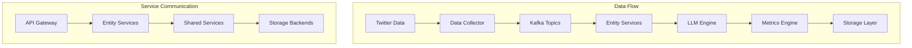

# Components

## Data Collector Service
**Responsibility**: 负责从外部数据源采集原始数据，进行初步清洗和格式化

**Key Interfaces**:
- Twitter API v2 集成接口
- 数据质量检查和过滤接口
- 数据发布到Kafka接口

**Dependencies**: Twitter API、Kafka Producer、S3存储

**Technology Stack**: Python FastAPI、Twitter API SDK、boto3

## LLM Inference Engine  
**Responsibility**: 提供统一的LLM推理服务，支持情感分析、实体识别、内容总结等功能

**Key Interfaces**:
- `/analyze/sentiment` - 情感分析接口
- `/extract/entities` - 实体识别接口  
- `/generate/summary` - 内容总结接口
- `/classify/importance` - 重要性分类接口

**Dependencies**: GPU集群、模型存储、Redis缓存

**Technology Stack**: Python、vLLM、CUDA、Llama-2-13B

## Metrics Calculation Engine
**Responsibility**: 计算三大核心指标和各类衍生指标，支持实时和批量计算模式

**Key Interfaces**:
- `/calculate/sentiment_index` - 情感指数计算
- `/calculate/popularity` - 热度指标计算
- `/calculate/propagation_speed` - 传播速度计算
- `/calculate/influence_score` - 影响力评分计算

**Dependencies**: InfluxDB、PostgreSQL、Flink Runtime

**Technology Stack**: Python、Apache Flink、InfluxDB Client

## Tweet Service
**Responsibility**: 处理Tweet实体的CRUD操作和业务逻辑

**Key Interfaces**:
- RESTful CRUD APIs
- 事件处理接口 (Kafka Consumer)
- 数据关系建立接口

**Dependencies**: PostgreSQL、Kafka、LLM Inference Engine

**Technology Stack**: Python FastAPI、SQLAlchemy、Kafka Client

## KOL Service  
**Responsibility**: KOL识别、分类、影响力评分和喊单效果追踪

**Key Interfaces**:
- `/kol/identify` - KOL识别接口
- `/kol/classify` - KOL分类接口
- `/kol/influence/calculate` - 影响力计算接口
- `/kol/call/track` - 喊单追踪接口

**Dependencies**: User Service、Price Data APIs、Metrics Engine

**Technology Stack**: Python FastAPI、pandas、scikit-learn

## API Gateway Service
**Responsibility**: 统一API入口，处理认证、授权、限流、路由

**Key Interfaces**:
- 客户端API代理
- WebSocket连接管理  
- 认证和授权中间件
- 指标收集和监控

**Dependencies**: 所有微服务、Redis、Kong

**Technology Stack**: Kong Gateway、Redis、Prometheus

## Component Diagrams

