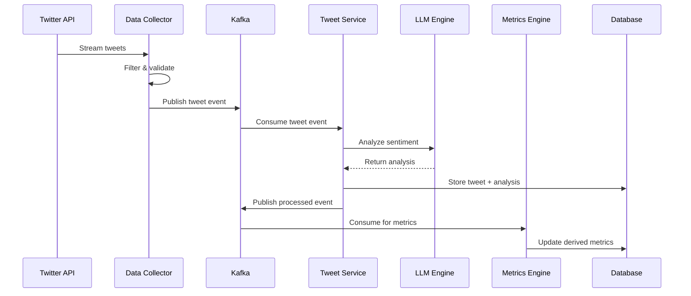
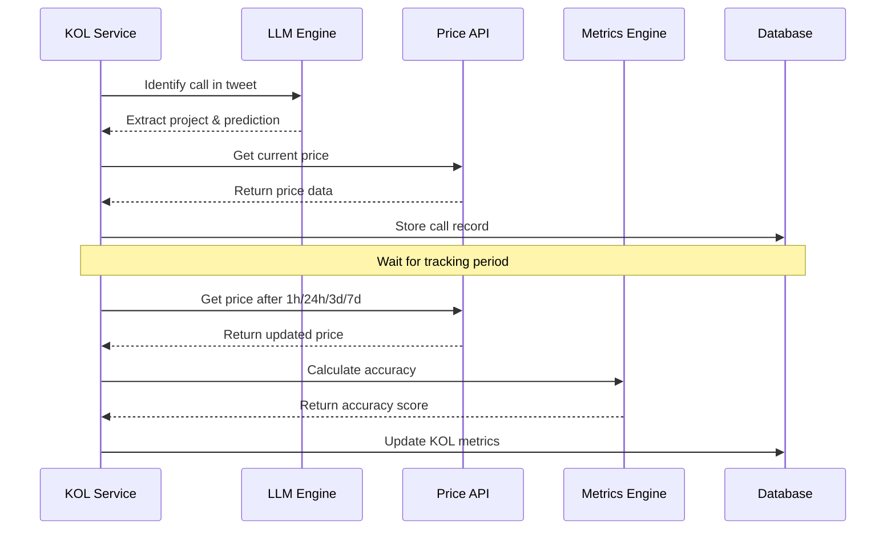

# Core Workflows

## Real-time Tweet Processing Workflow

```mermaid
sequenceDiagram
    participant T as Twitter API
    participant DC as Data Collector
    participant K as Kafka
    participant TS as Tweet Service
    participant LLM as LLM Engine
    participant ME as Metrics Engine
    participant DB as Database
    
    T->>DC: Stream tweets
    DC->>DC: Filter & validate
    DC->>K: Publish tweet event
    K->>TS: Consume tweet event
    TS->>LLM: Analyze sentiment
    LLM-->>TS: Return analysis
    TS->>DB: Store tweet + analysis
    TS->>K: Publish processed event
    K->>ME: Consume for metrics
    ME->>DB: Update derived metrics
```

## KOL Call Tracking Workflow

```mermaid
sequenceDiagram
    participant KOL as KOL Service
    participant LLM as LLM Engine
    participant PA as Price API
    participant ME as Metrics Engine
    participant DB as Database
    
    KOL->>LLM: Identify call in tweet
    LLM-->>KOL: Extract project & prediction
    KOL->>PA: Get current price
    PA-->>KOL: Return price data
    KOL->>DB: Store call record
    
    Note over KOL,DB: Wait for tracking period
    
    KOL->>PA: Get price after 1h/24h/3d/7d
    PA-->>KOL: Return updated price
    KOL->>ME: Calculate accuracy
    ME-->>KOL: Return accuracy score
    KOL->>DB: Update KOL metrics
```
