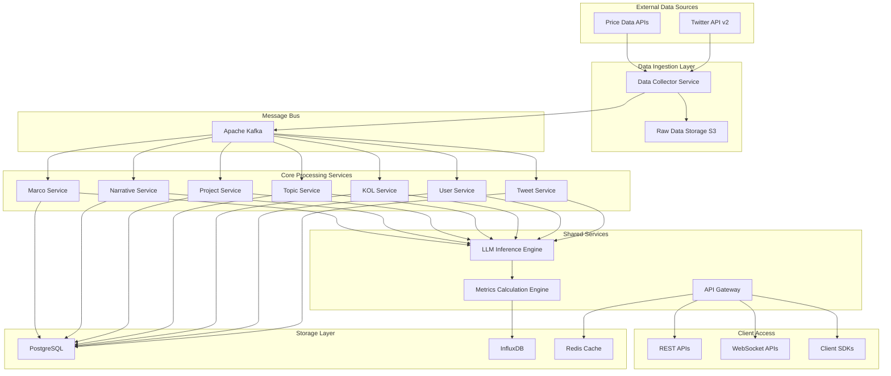

# High Level Architecture

## Technical Summary

本系统采用**混合微服务架构**，结合7个实体领域服务和共享核心组件。基于**事件驱动模式**和**实时流处理**，使用Apache Kafka作为消息总线。核心技术栈为Python FastAPI + Go高性能服务，配合GPU集群进行LLM推理。架构支持PRD中定义的10,000+ QPS和<200ms响应时间要求，同时实现三大核心指标（sentiment_index、popularity、summary）的实时计算和历史数据积累。

## High Level Overview

**架构风格**: 事件驱动微服务架构 + Monorepo
- **Repository结构**: Monorepo - 便于7个实体服务的依赖管理和代码复用
- **服务架构**: 领域微服务 + 共享服务层
  - 7个实体微服务：Tweet、Topic、User、KOL、Project、Narrative、Marco
  - 共享服务：LLM推理引擎、数据采集引擎、API网关、存储抽象层
- **数据流**: Twitter数据采集 → 实时ETL → 7层实体处理 → 衍生指标计算 → API输出
- **关键决策**: 选择事件驱动架构以支持实时数据处理和松耦合设计

## High Level Project Diagram

## Architectural and Design Patterns

- **事件驱动架构**: 使用Apache Kafka实现服务间解耦和异步处理 - *理由*: 支持高吞吐量数据处理和系统弹性扩展
- **CQRS模式**: 读写分离，写入PostgreSQL，读取通过Redis缓存优化 - *理由*: 满足高并发API查询需求
- **Repository模式**: 抽象数据访问逻辑，支持多存储后端 - *理由*: 便于测试和未来数据库迁移
- **策略模式**: 不同实体的指标计算算法可插拔 - *理由*: 支持指标算法的独立演进和A/B测试
- **发布-订阅模式**: 实体间数据变化通过事件通知 - *理由*: 实现松耦合的数据一致性管理
- **批处理 + 流处理混合**: Apache Flink处理实时流，Spark处理历史批量计算 - *理由*: 平衡实时性和计算效率
